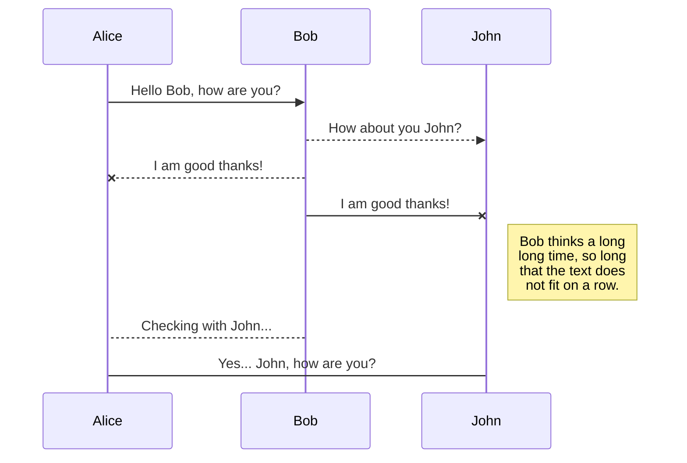

# Interaktionskonzept Seminar
Das Ziel des Projektes ist es die entstehenden Anfragen mit den jeweiligen Daten situationsbedingt an die richtigen Empfänger weiterzuleiten. Dazu soll es offene Schnittstellen für verschiedene Services geben die über ein Protokoll mit dem Server kommunizieren.

## Requirements
FREQ00 - Die Schnittstellen müssen Dokumentiert sein
FREQ01 - Die Kommunikation muss über ein Protokoll stattfinden
FREQ02 - Die Kommunikation muss drahtlos stattfinden
FREQ03 - Der MQTT Broker muss über das Internet erreichbar sein

## Protokoll
TBD
Synchron/Asynchron -> TBD

## Diagramme

Kommunikation zwischen Services und Server im Falle eines Unfalls

```
mermaid sequenceDiagram

Connected Vehicles ->> Server: send_sos(GPS_accident,accident_log)

Server->>Smart Vehicles Network: req_vehicle(GPS_accident,accident_log)
Smart Vehicles Network -->> Server: accept(time_till_arrival)

Server-->> Connected Vehicles: help_on_the_way(time_till_arrival)

Server->>Smart City Network: hospital_free(GPS_accident)
Smart City Network -->> Server: hospital(capacity,distance,GPS_Hospital)

Server->>Smart Vehicles Network: dest_Hospital(GPS_Hospital)
```


You can render UML diagrams using [Mermaid](https://mermaidjs.github.io/). For example, this will produce a sequence diagram:


